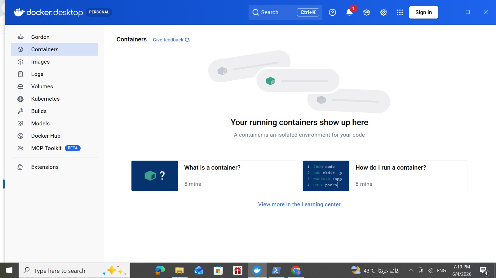
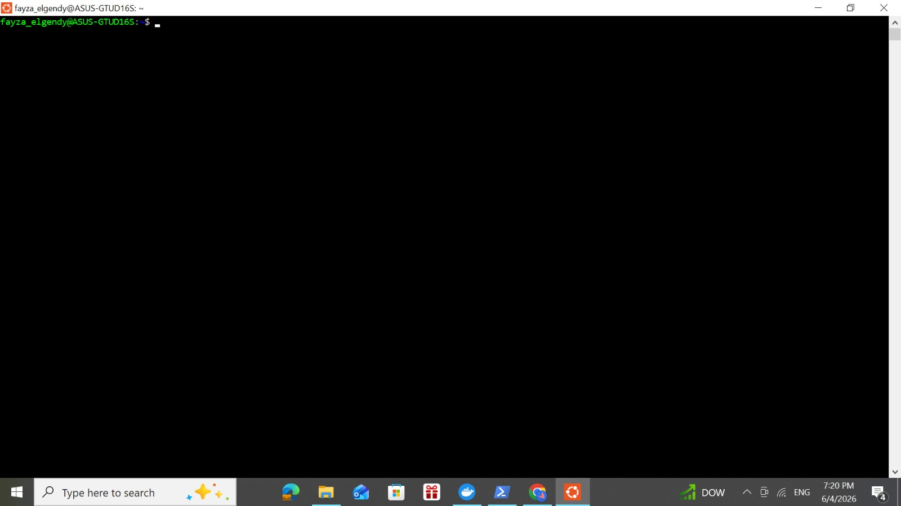
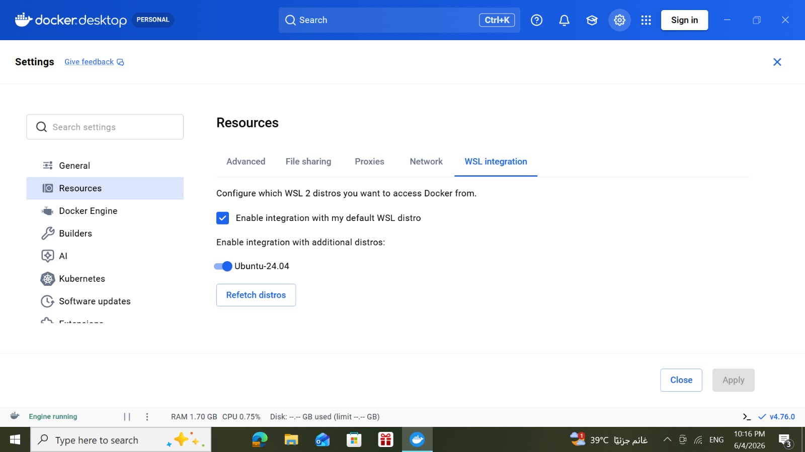
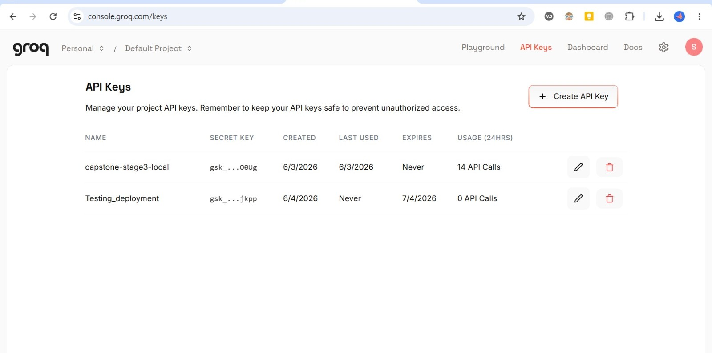

# Capstone OT Anomaly Detection Deployment Guide

This guide explains how to install and run the deployed capstone OT anomaly detection system on a new Windows laptop.

The deployment is designed for **acceptance testing**. The tester should follow the steps in order.

---

## 1. What the System Includes

The deployed system includes:

1. OT simulator and OT dashboard
2. Django security monitoring dashboard
3. Redis-based alert pipeline
4. Stage 1/2 alert replay producer
5. Stage 3 IR/RAG incident response service

The final system has two sides:

### OT Simulator Side

The OT simulator runs from the source files inside:

```text
ot/curtin-ics-simlab/
```

It starts the OT environment containers, including PLCs, HMIs, sensors, valves, bottle factory, network telemetry, OT Redis, and the OT Streamlit dashboard.

The OT dashboard opens at:

```text
http://localhost:8501
```

### AI / Django / Stage 3 Side

The AI side uses prebuilt Docker images hosted on GitHub Container Registry. It starts:

- Django web dashboard
- Django alert consumer
- AI Redis
- Stage 1/2 alert replay producer
- Stage 3 IR/RAG incident response service

The Django dashboard opens at:

```text
http://localhost:8000
```

The Stage 3 health endpoint opens at:

```text
http://localhost:8001/health
```

---

## 2. Official Deployment Mode

The official acceptance testing mode uses **dataset-based alert replay**.

The flow is:

```text
Stage 1/2 replay producer
→ AI Redis
→ Django consumer
→ SQLite database
→ Django dashboard
→ Stage 3 IR/RAG service
```

The live OT prediction flow is not used as the official acceptance testing mode. It is considered experimental/future work.

The OT simulator still runs and is shown through the OT dashboard.

---

## 3. Required Software

Install the following before running the system.

Important notes before starting: 

### Network Requirement

Before pulling Docker images or running the deployment, connect the laptop to a stable normal router/Wi-Fi network.

Avoid using:

- Mobile hotspot
- VPN
- Restricted university/company firewall
- Proxy-based networks

During acceptance testing, image pulling from GitHub Container Registry sometimes failed on hotspot/VPN/firewall networks with errors such as:

failed to copy: httpReadSeeker: failed open: failed to do request ... EOF

### Windows Requirement

The deployment requires a Windows version that supports Docker Desktop with WSL 2 and Ubuntu 24.04 LTS.

Recommended:

Windows 11, 64-bit
Updated Windows 10, 64-bit, version 2004 or later, build 19041 or later

Older Windows versions may not support Ubuntu 24.04 through WSL or may fail to run Docker Desktop correctly.

### 3.1 Docker Desktop

Download Docker Desktop for Windows:

```text
https://docs.docker.com/desktop/setup/install/windows-install/
```

Install Docker Desktop normally, then open it and make sure Docker Desktop starts successfully.

Screenshot reference:



---

### 3.2 WSL Ubuntu 24.04 LTS

Use **Ubuntu 24.04 LTS**.

Do **not** use Ubuntu 26.04 for this deployment. Ubuntu 26.04 uses Python 3.14, which is too new for some OT simulator dependencies.

The AI/Django/Stage 3 services already use Python 3.13 inside Docker images, so the tester does **not** need to install Python 3.13 manually.

#### Option A: Install Ubuntu 24.04 using PowerShell

Open PowerShell as Administrator and run:

```powershell
wsl --install -d Ubuntu-24.04
```

Wait until the download and installation finishes.

Then open Ubuntu 24.04 and create:

- Unix username
- Password

Check the installed WSL distributions:

```powershell
wsl -l -v
```

Expected:

```text
Ubuntu-24.04    Running    2
```

#### Option B: Install Ubuntu 24.04 from Microsoft Store

If the PowerShell installation is slow or fails:

1. Open Microsoft Store.
2. Search for:

```text
Ubuntu 24.04 LTS
```

3. Install it.
4. Open Ubuntu 24.04.
5. Create the Unix username and password.

Screenshot reference:



---

### 3.3 Enable Docker WSL Integration

Open Docker Desktop.

Go to:

```text
Settings → Resources → WSL integration
```

Enable:

```text
Enable integration with my default WSL distro
```

Also enable the switch for:

```text
Ubuntu-24.04
```

Click **Apply & Restart** if Docker asks.

Screenshot reference:



After Docker restarts, open Ubuntu 24.04 and test:

```bash
docker --version
docker ps
```

Expected:

- `docker --version` shows the Docker version.
- `docker ps` runs without a permission error.

---

### 3.4 Git

Download Git for Windows:

```text
https://git-scm.com/install/windows
```

Install it normally.

Git will also be installed inside Ubuntu in the setup command below.

---

### 3.5 Groq API Key

Open Groq Console:

```text
https://console.groq.com/home
```

Create or copy an API key.

Screenshot reference:



---

## 4. Install Required Ubuntu Packages

Open Ubuntu 24.04 and run:

```bash
sudo apt update
sudo apt install -y git curl python3 python3-venv python3-pip socat
```

The `socat` package is required by the OT simulator.

The `deploy_all.sh` script also checks for missing required packages and attempts to install them automatically, but it is still recommended to run this command once during setup.

Check Python:

```bash
python3 --version
```

Expected:

```text
Python 3.12.x
```

---

## 5. Clone the Repository

Inside Ubuntu 24.04, run:

```bash
git clone https://github.com/SomayaElgendy/capstone-ot-anomaly-detection-deployment.git
cd capstone-ot-anomaly-detection-deployment
```

---

## 6. Create the Environment File

Copy the example environment file:

```bash
cp .env.example .env
```

Open the `.env` file:

```bash
nano .env
```

Add the real Groq API key:

```env
GROQ_API_KEY=your_real_groq_api_key_here
DEBUG=True
ALLOWED_HOSTS=localhost,127.0.0.1,0.0.0.0
```

Save and exit nano:

```text
CTRL + O
Enter
CTRL + X
```

---

## 7. Pull the Prebuilt Docker Images

Run:

```bash
./pull_images.sh
```

This pulls the prebuilt Docker images from GitHub Container Registry:

- Django backend image
- Stage 1/2 producer image
- Stage 3 service image
- Redis image

This avoids rebuilding the heavy Stage 3 image locally.

---

## 8. Start the Full System

Run:

```bash
./deploy_all.sh
```

The script automatically handles the common setup problems found during testing:

1. Checks that `.env` exists.
2. Checks Docker availability from Ubuntu.
3. Installs missing Ubuntu packages such as `socat`.
4. Prepares the shared SQLite database file.
5. Prevents the SQLite mount error where `db.sqlite3` becomes a directory.
6. Creates the Stage 3 outputs folder.
7. Starts the OT simulator.
8. Starts the AI/Django/Stage 3 services.

When deployment finishes, open:

```text
OT Dashboard:      http://localhost:8501
Django Dashboard:  http://localhost:8000
Stage 3 Health:    http://localhost:8001/health
```

Expected Stage 3 health response:

```json
{"status":"ok"}
```

---

## 9. Replay Alerts

If alerts are not currently moving, or if the tester wants to show alerts appearing live again on the Django dashboard, run:

```bash
./replay.sh
```

This restarts only the Stage 1/2 alert producer.

To watch the Django consumer saving alerts:

```bash
docker compose -f docker-compose.ghcr.yml logs -f django-consumer
```

To stop only the replay producer:

```bash
./stop_replay.sh
```

This does not stop Django, Stage 3, Redis, or the OT simulator.

---

## 10. Generate an Incident Response Report

From the Django dashboard:

1. Open:

```text
http://localhost:8000
```

2. Log in.
3. Open an alert.
4. Click **Generate IR**.
5. Wait for the Stage 3 service to generate the report.

The generated report should appear in the dashboard.

The report can be downloaded as:

- Markdown
- Word document

---

## 11. Chat with Stage 3

From the alert detail page:

1. Type a question in the chat box.
2. Send the message.
3. Wait for the response.

Django sends the selected alert context to Stage 3, and Stage 3 returns the response.

---

## 12. Stop the Full System

Run:

```bash
./stop_all.sh
```

This stops:

- AI containers
- Django containers
- Stage 3 container
- AI Redis
- OT simulator containers
- OT Redis
- OT dashboard

Verify:

```bash
docker ps
```

There should be no running project containers.

---

## 13. Useful Commands

Check running containers:

```bash
docker ps
```

Check AI services:

```bash
docker compose -f docker-compose.ghcr.yml ps
```

View Django consumer logs:

```bash
docker compose -f docker-compose.ghcr.yml logs -f django-consumer
```

View Stage 3 logs:

```bash
docker logs capstone-stage3 --tail 100
```

Test Stage 3 from the host:

```bash
curl http://localhost:8001/health
```

Test Stage 3 from inside Django:

```bash
docker exec -it capstone-django-web python -c "import requests; print(requests.get('http://stage3:8001/health', timeout=10).text)"
```

Expected:

```json
{"status":"ok"}
```

---

## 14. If Something Still Fails

The deployment script is designed to prevent the common issues automatically. If something still fails, run:

```bash
./stop_all.sh
docker ps
```

Then start again:

```bash
./deploy_all.sh
```

If Docker cannot be accessed from Ubuntu, check Docker Desktop WSL integration:

```text
Docker Desktop → Settings → Resources → WSL integration → Enable Ubuntu-24.04
```

Do not manually start individual containers from Docker Desktop. Start the system using the scripts.

---

## 15. Final Acceptance Testing Flow

Use this sequence:

```bash
./pull_images.sh
./deploy_all.sh
./replay.sh
```

Then verify:

1. OT dashboard opens at `http://localhost:8501`
2. Django dashboard opens at `http://localhost:8000`
3. Stage 3 health opens at `http://localhost:8001/health`
4. Alerts appear after replay
5. IR generation works
6. Chat works
7. Report download works
8. `./stop_all.sh` stops the system cleanly
